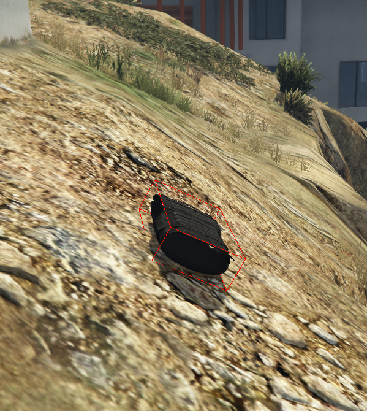
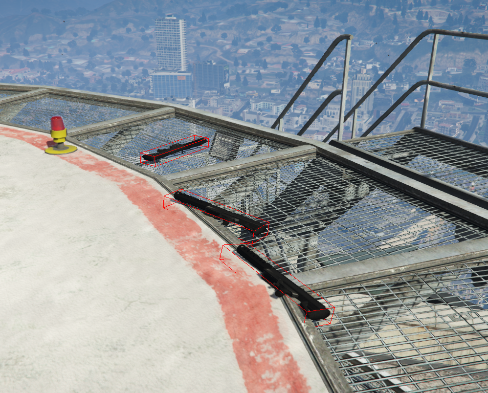

# SGR — Safe Ground Raycast (RAGE:MP)

Safe Ground Raycast (SGR) — This is a system for automatically aligning objects on a surface in RAGE:MP.
It analyzes surface under the object through raycast sampling, calculates plane normal, and rotates object using quaternion rotation, preserving original yaw.

---

## Demo 

YoTube: https://youtu.be/z-98HKB7DGA
<p align="center">
  
  
  
</p>

---

## Motivation

This system originates from a challenge I once couldn’t solve.

Some time ago, I worked as a developer on a RAGE:MP project for a client that aimed to recreate CS:GO-style gameplay. During development, I was assigned a task to build a system for aligning objects to uneven surfaces. At that time, I didn’t yet have enough experience to complete it successfully, and eventually the project was discontinued.

After gaining significantly more experience i, I decided to revisit this problem in my free time and build a proper solution from scratch.

---

## Installation

Place the `sgr` folder inside your client package.

Make sure the scripts are import to your client packages.

## Quick Usage

Apply alignment to any prop:

```ts
sgr.apply(ObjectMp, ?lay_on_side, ?iterations);
```

---

## Configuration
Main configuration is located in:
`sgr/settings.cfg`

Important options:

`iters` — number of alignment iterations

`lay_on_side` — rotate object to side orientation

`eps` — small vertical offset to prevent clipping

`z_hint` — initial height used for ground detection

`min_samples` — minimum raycast samples required

`ray.up` — ray start offset

`ray.down` — ray length

`ray.flags` — collision mask

---

## How it works

Retrieve model bounding box dimensions.

Generate 8 bounding box corner points.

Select 4 lowest corners.

Perform downward raycasts.

Fit a support plane using least-squares method.

Build a quaternion aligned to the plane normal.

Preserve original yaw rotation.

Adjust object Z position to sit flush on surface.
